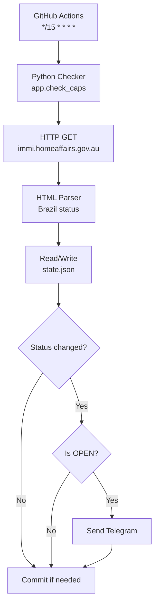

# WHV 462 Country Caps Monitor — GitHub Actions + Telegram

## Objective

Monitor the “Status of country caps” page of the Australian **Work and Holiday Visa (subclass 462)** program and **send a Telegram notification when Brazil’s status changes to `open`**, checking the site every **15 minutes** via **GitHub Actions**, persisting simple state in `state.json` inside the repository.

Monitored source:

* [https://immi.homeaffairs.gov.au/what-we-do/whm-program/status-of-country-caps](https://immi.homeaffairs.gov.au/what-we-do/whm-program/status-of-country-caps)

---

## Quickstart

### Run locally

```bash
python3 -m venv .venv
. .venv/bin/activate
python -m pip install -r requirements.txt
python -m app.check_caps
```

### GitHub Actions schedule
- Workflow: .github/workflows/whv-checker.yml
- Triggers:
  - schedule: */15 * * * * (UTC)
  - workflow_dispatch (manual)
- Permissions: contents: write (to commit state.json when it changes)

### Telegram configuration
- Create a bot with BotFather and obtain TELEGRAM_BOT_TOKEN
- Get TELEGRAM_CHAT_ID (e.g., from @userinfobot or via API)
- Set repository secrets:
  - TELEGRAM_BOT_TOKEN
  - TELEGRAM_CHAT_ID

### State persistence
- File: state.json at repo root
- Keys:
  - last_status
  - last_checked_at (ISO)
  - last_notified_status
- Updated every run; committed by the workflow only if changed.

---

## High-level overview

### Components

1. **Checker (Python)**
   - fetches the target webpage (HTTP GET)
   - parses the status for Brazil
   - updates `state.json`
   - sends Telegram only on transition to `open`

2. **Scheduler (GitHub Actions)**
   - runs every 15 minutes (UTC) and on manual dispatch
   - commits `state.json` when modified

---

## End-to-end data flow

1. **GitHub Actions** triggers execution every 15 minutes.
2. **Python Checker** performs HTTP GET to the target URL.
3. **HTML Parser** extracts Brazil’s status.
4. Checker compares with `state.json`.
5. If status changed, updates `state.json`.
6. If new status is `open` and not previously notified, sends Telegram.

---

## Architecture diagram (Mermaid)



---

## Notification rules

Send Telegram only if:
- current_status == "open" and
- last_notified_status != "open"

---

## Telegram setup
1. Create a bot with BotFather → get TELEGRAM_BOT_TOKEN
2. Find TELEGRAM_CHAT_ID
3. Add GitHub repository secrets:
   - TELEGRAM_BOT_TOKEN
   - TELEGRAM_CHAT_ID

---

## Troubleshooting

* Schedule runs in the default branch and in UTC
* Ensure `permissions: contents: write` in workflow
* Check that `state.json` exists and is tracked
* Missing Telegram secrets doesn’t break runs; only logs a warning
