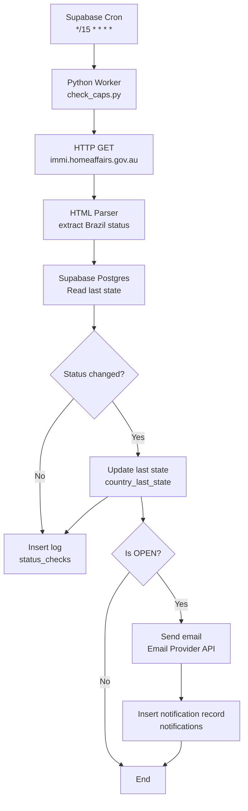

# WHV 462 Country Caps Monitor — Architecture

## Objective

Monitor the “Status of country caps” page of the Australian **Work and Holiday Visa (subclass 462)** program and **send an email notification when Brazil’s status changes to `open`**, checking the site every **15 minutes**, with state persistence to avoid duplicate alerts.

Monitored source:

* [https://immi.homeaffairs.gov.au/what-we-do/whm-program/status-of-country-caps](https://immi.homeaffairs.gov.au/what-we-do/whm-program/status-of-country-caps)

---

## High-level overview

### Components

1. **Worker (Python)**
   Responsible for:

   * fetching the target webpage (HTTP GET)
   * parsing the status for **Brazil**
   * comparing it with the last stored status
   * persisting check logs
   * triggering an email notification on transition to `open`

2. **Scheduler (Supabase Cron)**
   Triggers the Worker every 15 minutes (no local machine required).

3. **Database (Supabase Postgres)**
   Stores:

   * the last known status for Brazil
   * a history of checks
   * a history of sent notifications

4. **Notifier (Email via API)**
   Sends an email **only when a transition to `open` occurs**.

---

## End-to-end data flow

1. **Supabase Cron** triggers execution every 15 minutes.
2. **Python Worker** performs an HTTP GET to the target URL.
3. **HTML Parser** extracts the status for `Brazil`.
4. The Worker queries the database for the **last known status**.
5. If the status **changed**:

   * updates `country_last_state`
   * inserts a record into `status_checks`
6. If the new status is **`open`**:

   * sends an email notification
   * records the event in `notifications`

---

## Architecture diagram (Mermaid)

---

## Data model (Supabase Postgres)

### 1) `country_last_state`

Stores the last known state per country.

* `country` (text, PK) — e.g. `"Brazil"`
* `status` (text) — `"paused" | "open" | "closed"`
* `last_checked_at` (timestamptz)
* `last_notified_status` (text, nullable) — last status that triggered a notification

**Purpose:** fast comparison and deduplication.

---

### 2) `status_checks`

Stores the full history of checks.

* `id` (uuid, PK)
* `country` (text)
* `status` (text)
* `checked_at` (timestamptz)
* `source_url` (text)
* `raw_excerpt` (text, nullable) — optional HTML snippet for debugging
* `error` (text, nullable) — parsing or HTTP errors

**Purpose:** auditing, debugging, and observability.

---

### 3) `notifications`

Stores sent alerts.

* `id` (uuid, PK)
* `country` (text)
* `status` (text) — usually `"open"`
* `sent_at` (timestamptz)
* `recipient` (text)
* `provider` (text) — e.g. `"resend"`
* `provider_message_id` (text, nullable)

**Purpose:** prevent duplicate notifications and provide traceability.

---

## Scheduling

* Cron expression: `*/15 * * * *`
* Each run must be **idempotent**
* Multiple executions must not result in duplicate emails

---

## Notification rules (deduplication)

Send an email **only if**:

* `current_status == "open"` **and**
* `previous_status != "open"` **or**
* `last_notified_status != "open"`

After sending:

* update `last_notified_status = "open"`.

---

## Deployment strategy

**Serverless Python Worker + Supabase**

* Host the Python Worker on:

  * Cloud Run / Render / Railway / Fly.io / VPS
* Supabase Cron triggers the Worker via HTTP endpoint
* Worker uses environment variables:

  * `SUPABASE_URL`
  * `SUPABASE_SERVICE_ROLE_KEY`
  * `EMAIL_PROVIDER_API_KEY`
  * `ALERT_RECIPIENT_EMAIL`

---

## Resilience & best practices

* HTTP timeout + retries (e.g. 10s, 2 retries)
* Custom User-Agent
* Defensive parsing (HTML structure may change)
* Error logging in `status_checks.error`
* Notify only on transitions to `open`
* Store a small `raw_excerpt` to simplify parser fixes

---

## Implementation checklist

1. Create a Supabase project
2. Create tables:

   * `country_last_state`
   * `status_checks`
   * `notifications`
3. Implement Python Worker:

   * fetch HTML
   * parse Brazil status
   * compare with last state
   * persist logs
   * notify on `open`
4. Deploy Worker
5. Configure Supabase Cron:

   * `*/15 * * * *` calling the Worker endpoint
6. Configure email provider (API-based) and secrets
7. Test:

   * mock an `open` status
   * confirm single notification behavior
